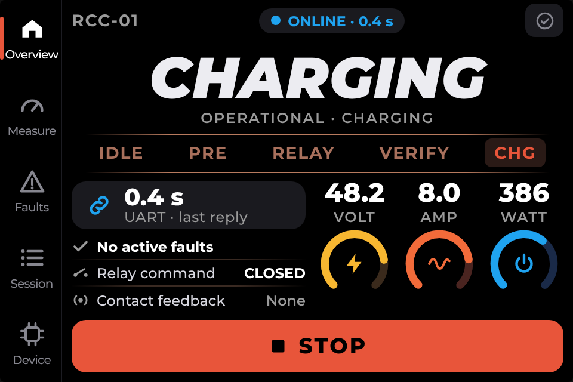
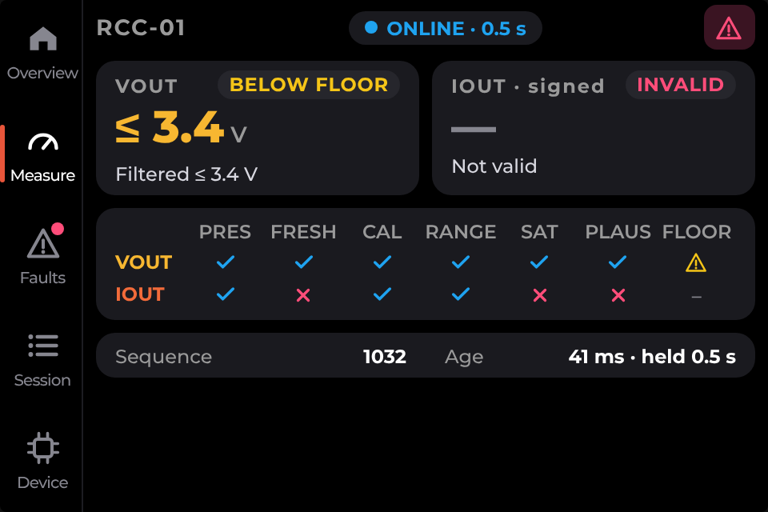
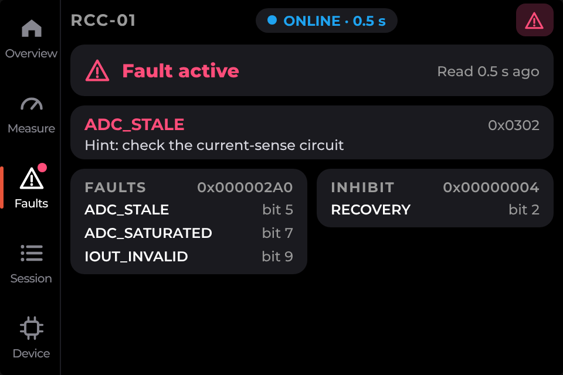
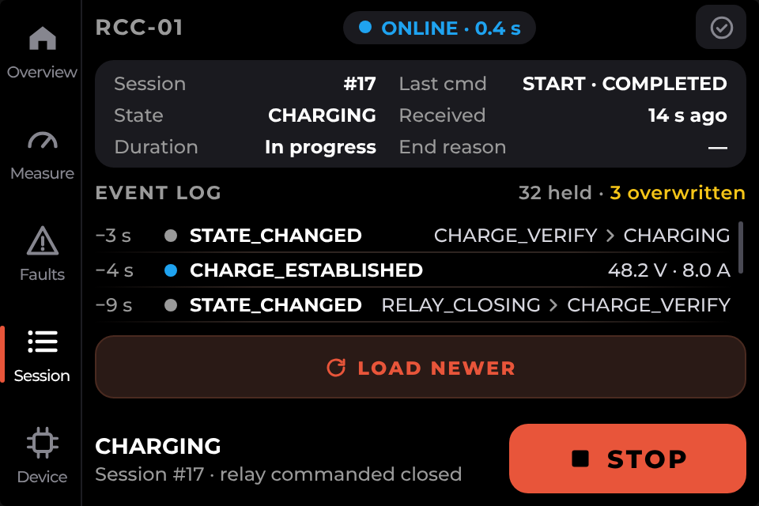
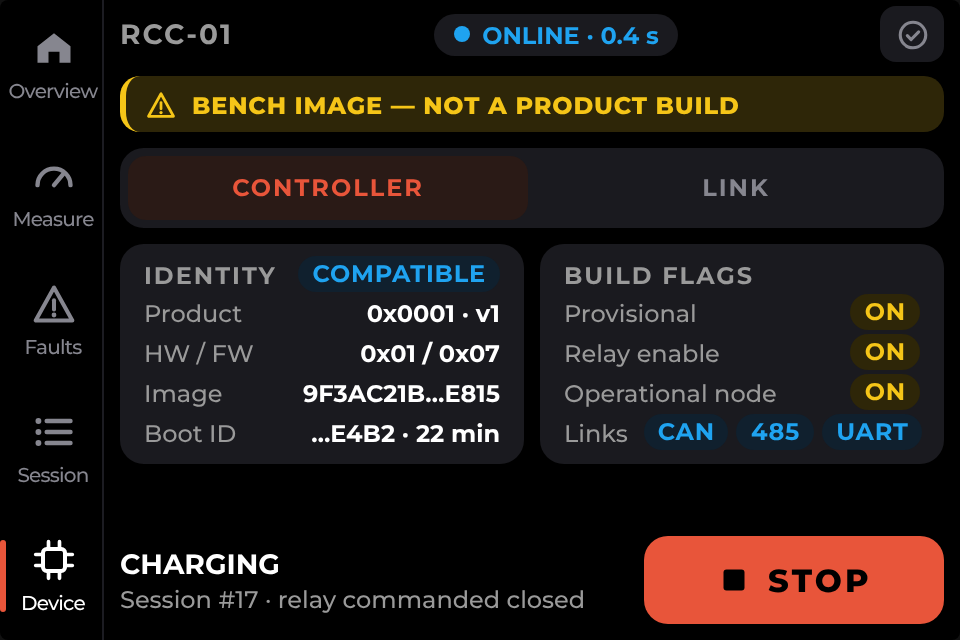
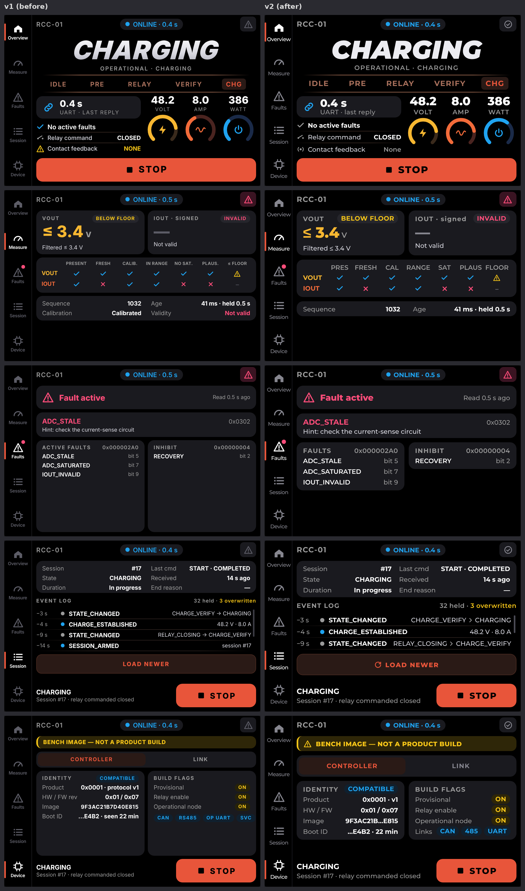

  <h1>Robot Charge Controller HMI</h1>
  
<strong>An ESP32 touchscreen interface for monitoring and controlling the Robot Charge Controller over its operational UART.</strong>

  

    
    
    
    
    
  

  

    <a href="#interface-preview">Interface</a> &middot;
    <a href="#build-and-upload">Build &amp; Upload</a> &middot;
    <a href="#controller-simulator">Simulator</a> &middot;
    <a href="#automated-tests">Tests</a> &middot;
    <a href="#documentation">Documentation</a>
  

## Interface Preview

Five pages cover live monitoring, charging controls and controller diagnostics.
Select any preview to view the full-size image.

<table align="center">
  <tr>
    <td align="center" width="50%">
       
      <strong>Overview</strong> 
      Charging state and controls
    </td>
    <td align="center" width="50%">
       
      <strong>Measure</strong> 
      Measurements and data quality
    </td>
  </tr>
  <tr>
    <td align="center" width="50%">
       
      <strong>Faults</strong> 
      Faults and safety interlocks
    </td>
    <td align="center" width="50%">
       
      <strong>Session</strong> 
      Session details and event history
    </td>
  </tr>
  <tr>
    <td align="center" colspan="2">
       
      <strong>Device</strong> 
      Controller identity and diagnostics
    </td>
  </tr>
</table>

  <em>Revised (v2) UI design previews with illustrative data. 
  Not photographs of the display or verified charging sessions; rendered firmware may differ.</em>

Regenerate the page previews

The five 960 × 640 PNGs in `assets/ui/` are exported from the revised (right-hand)
column of [the original comparison](assets/hmi-ui-v1-vs-v2.png), without changing
the source image. From the repository root, run:

~~~powershell
powershell -ExecutionPolicy Bypass -File firmware/tools/export_readme_previews.ps1 -Force
~~~

## Overview

Robot Charge Controller HMI runs on the **ESP32-3248S035R** in **480 × 320 landscape**
orientation, using **PlatformIO, ESP-IDF and LVGL**. It reads controller status and
measurements, displays faults and session history, and requests START/STOP through
the operational UART.

Charging decisions, interlocks and relay control remain owned by the controller.

## UI Pages

| Page | Information |
|---|---|
| Overview | Charging state, stage strip, link freshness, voltage/current/power and START/STOP |
| Measure | Raw and filtered measurements, validity bits and sample age |
| Faults | Primary fault, active fault mask and inhibit reasons |
| Session | Session information, last command result and recent events |
| Device | Controller identity, build flags and link diagnostics |

View the five-page design comparison

  

  <strong>Five-Page Design Comparison</strong> 
  <em>Left: earlier design. Right: revised design reference. Both use illustrative data; 
  the rendered firmware can differ as implementation evolves.</em>

## Technical Specifications

| Item | Configuration |
|---|---|
| Board | ESP32-3248S035R |
| Display | ST7796, 480 × 320 landscape |
| Touch | XPT2046 resistive touchscreen |
| Flash | 4 MB, verified on the development board |
| Build system | PlatformIO |
| Platform | Espressif32 7.1.3 |
| Framework | ESP-IDF 6.1.0 |
| UI | LVGL 9.6.0 |
| Controller link | UART0 on P1, 115200 baud, 8N1 |

## Key Features

- Five touchscreen pages with output voltage, current and calculated power.
- Measurement validity, freshness and filtered values.
- Controller state, relay command, faults and inhibit masks.
- Session information and controller event log.
- Device identity, build flags and UART diagnostics.
- START confirmation, STOP requests and command-result feedback.
- Lost-link and unconfirmed-command indications.
- Python controller simulator for testing the real display over USB.

## Project Status

| Area | Current state |
|---|---|
| Firmware build | Successful |
| Display and touch | Initialization and navigation tested on the development board |
| UART simulator host tests | 33 tests passed |
| COM4 monitoring smoke test | 46 requests answered in eight seconds; no invalid frames |
| Touch-driven START/STOP workflows | Hardware verification pending |
| Real controller integration | Pending |
| Long-duration operation | Pending |

## Build and Upload

Install PlatformIO, then run from the repository root:

~~~sh
cd firmware
pio run
pio run --target upload --upload-port COM4
~~~

Replace COM4 with the display's USB serial port.

UART0 carries the binary controller protocol, so application console logging is
disabled. Close Serial Monitor and the controller simulator before uploading.

See [hardware documentation](docs/hmi-hardware.md) for controller wiring and
power arrangements.

## Controller Simulator

Keep the real controller disconnected from P1 TX/RX. Connect the display to the
PC over USB and close Serial Monitor.

From the firmware directory:

~~~sh
python -m pip install -r tools/controller_sim_requirements.txt
python tools/controller_sim.py --port COM4
~~~

The simulator starts with the controller in IDLE. Use the touchscreen to request
START/STOP, or enter terminal commands to change scenarios:

~~~text
charging
fault overcurrent
ready
authority deny
link silence
link normal
reboot
~~~

Enter help for all commands and quit to release the serial port.

Simulator values and relay states are synthetic; the simulator does not operate
physical charging hardware.

See the [simulator guide](docs/controller-simulator.md) for failure injection and
expected results, including the Windows command using PlatformIO's Python.

## Automated Tests

From the firmware directory:

~~~sh
python -B -m unittest discover -s test/host -p test_controller_sim.py -v
~~~

Tests cover framing, checksums, fragmentation, response schemas, START/STOP,
duplicate requests, authorization, event pagination and reboot. The optional
independent controller-codec comparison is described in the simulator guide.

The [desktop UI simulator](firmware/tools/sim/README.md) provides a separate
workflow for rendering the LVGL interface on a PC.

## Control Behavior

- The controller selects one active control interface.
- Monitoring access does not imply START/STOP authority.
- ACCEPTED does not mean charging has started.
- A timeout means the command outcome is not confirmed.
- Communication loss does not automatically stop charging.
- Relay command status does not confirm physical contact position.

The HMI does not replace the controller's protection logic or a hardware
emergency stop.

## Repository Structure

~~~text
Robot-Charge-Controller-HMI/
├── README.md
├── assets/                  # Original design images
│   └── ui/                  # Five individual v2 page previews
├── docs/                    # Design decisions, protocol and test guides
│   └── mockups/             # HTML interface references
├── firmware/
│   ├── platformio.ini       # Pinned build environment
│   ├── src/                 # Board support, LVGL UI, UART codec and link task
│   │   └── hmi_fonts/       # Generated UI fonts
│   ├── test/host/           # Host-side tests
│   └── tools/               # UART controller simulator and UI tooling
└── hardware/                # Board reference material
~~~

## Documentation

| Resource | Description |
|---|---|
| [Documentation Index](docs/README.md) | Reading order and implementation status |
| [Design Decisions](docs/decisions.md) | Board, UART, toolchain and language decisions |
| [Hardware and Wiring](docs/hmi-hardware.md) | Display hardware, power and controller connection |
| [Controller Interface](docs/controller-interface.md) | Framing, command payloads and control semantics |
| [UI Pages and Information](docs/ui-pages-and-information.md) | Page contents, states and operator feedback |
| [Landscape UI Mockup](docs/mockups/hmi-ui-landscape.html) | Interactive design reference; open locally in a browser |
| [Desktop UI Simulator](firmware/tools/sim/README.md) | Render and inspect the LVGL interface on a PC |
| [Controller Simulator](docs/controller-simulator.md) | Interactive scenarios, fault injection and host tests |
| [Controller Change Requests](docs/controller-change-requests.md) | Interface dependencies and proposed controller changes |
